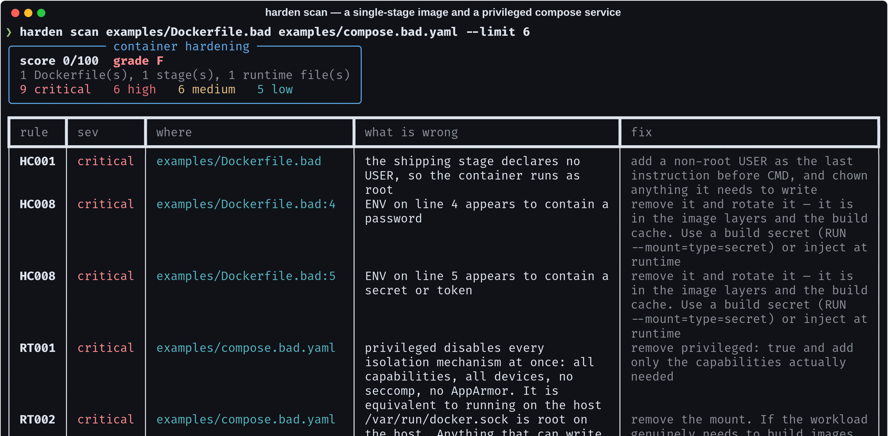
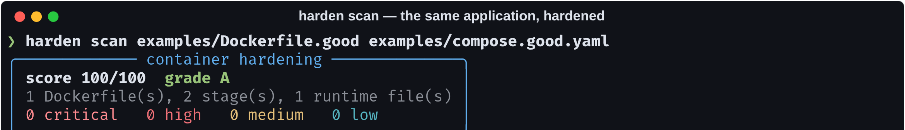
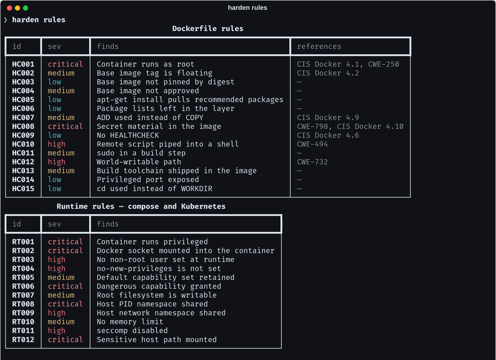
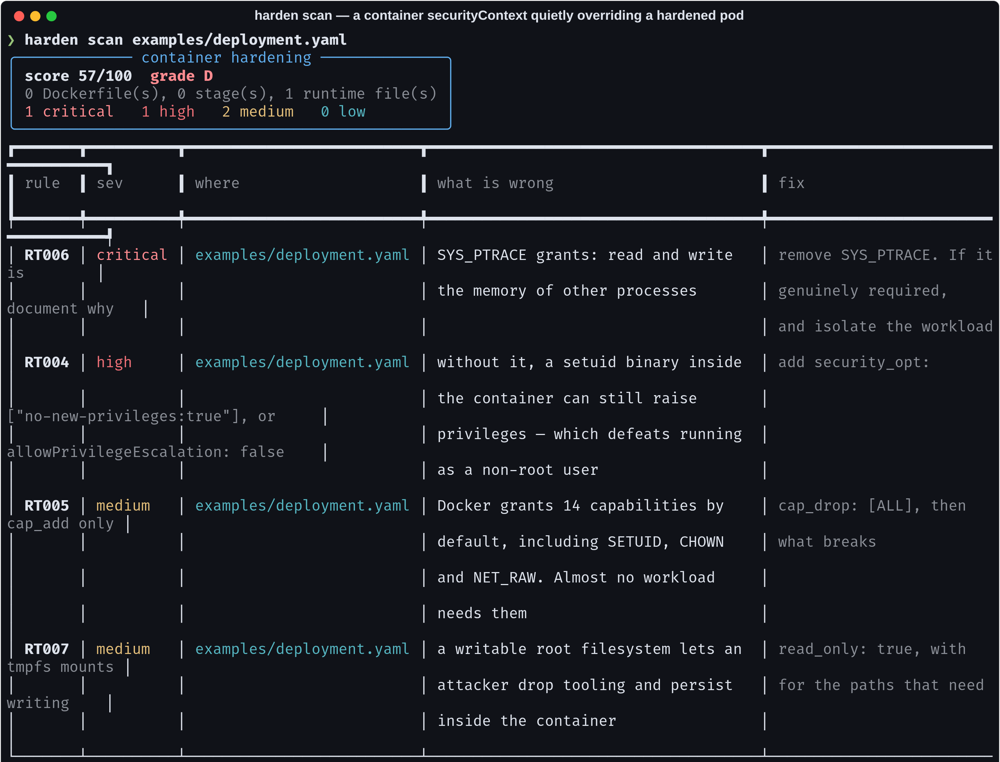

# container-hardening-scanner

> A perfect Dockerfile still runs privileged if the compose file says so. Half
> of container hardening — `no-new-privileges`, dropped capabilities, a
> read-only root filesystem, seccomp — cannot be expressed in a Dockerfile at
> all, so this reads the runtime configuration too.

[](https://github.com/Vincent-P-essy/container-hardening-scanner/actions/workflows/ci.yml)
[](pyproject.toml)
[](tests)
[](src/harden/rules.py)
[](src/harden/scanner.py)
[](LICENSE)

Multi-stage-aware Dockerfile analysis plus Docker Compose and Kubernetes
runtime checks, in one report, with SARIF for GitHub code scanning.



## Multi-stage awareness is the difference

A `USER root` in a builder stage is **not** a finding — nothing from that stage
ships. Reporting it is how a linter earns the reputation that gets it deleted
from CI.

```dockerfile
FROM golang:1.23 AS builder
USER root                      # not reported: this stage ships nothing
RUN go build -o /out/app

FROM gcr.io/distroless/static-debian12:nonroot
COPY --from=builder /out/app /app
USER nonroot                   # this is the one that matters
```



Two parsing details make that possible, and both are where line-oriented
linters go wrong:

- **Line continuations are joined first.** A `RUN` spanning eight backslashed
  lines is one instruction. Scanning its lines separately reports the same
  issue eight times, or misses the `--no-install-recommends` two lines below.
- **`COPY --from` is resolved**, so a stage nothing copies from is recognisably
  build-only.

The one exception is **secrets**: those are checked in *every* stage, because a
credential in a builder stage is still in the build cache and in any pushed
intermediate layer.

## The runtime rules



Twelve checks that no Dockerfile can express, read from a compose file or a
Kubernetes workload and normalised into one shape:

| | |
| --- | --- |
| `RT001` | `privileged: true` — disables every isolation mechanism at once |
| `RT002` | the Docker socket mounted in — root on the host, one API call from escape |
| `RT004` | `no-new-privileges` missing — a setuid binary defeats your non-root user |
| `RT005` | the default 14 capabilities retained, including `SETUID` and `NET_RAW` |
| `RT006` | `SYS_ADMIN`, `SYS_MODULE`, `SYS_PTRACE` and friends, each with what it grants |
| `RT008` | host PID namespace — read the memory of every process on the host |
| `RT012` | `/`, `/etc`, `/proc`, `/var/run` mounted from the host |

### Kubernetes has two security contexts



The pod has one, each container has another, and the container's wins. This
deployment declares `runAsNonRoot`, `runAsUser: 10001` and `RuntimeDefault`
seccomp at the pod level — and then the container quietly sets
`allowPrivilegeEscalation: true`, turns off the read-only root filesystem, and
adds `SYS_PTRACE`.

A checker that reads only the pod `securityContext` reports this workload as
hardened. That is why the normaliser merges container over pod, and why there
is a test named after it.

## Findings name a change, not a principle

```
HC010  high      the build pipes a script from the network straight into a shell —
                 it executes whatever that URL returns today
       fix       download to a file, verify a checksum or signature, then run it

RT005  medium    Docker grants 14 capabilities by default, including SETUID,
                 CHOWN and NET_RAW. Almost no workload needs them
       fix       cap_drop: [ALL], then cap_add only what breaks
```

A test asserts no fix contains "least privilege", "best practice", "as
appropriate" or "consider" — those cannot be actioned, only agreed with.

## Baselining by identity, not by count

```bash
harden scan . --write-baseline .harden-baseline.json   # accept today's findings
harden scan . --baseline .harden-baseline.json --fail-over high
```

A baseline is the **set of accepted finding identities** (`rule:file:stage:line`),
not a number. "We had 12 findings and we still have 12" passes a count-based
check while a critical quietly replaces a low. Here a *new* finding fails even
when the total has not moved.

The identity deliberately excludes the message text, so rewording a rule does
not invalidate every baseline that referenced it.

## Install and run

```bash
git clone https://github.com/Vincent-P-essy/container-hardening-scanner
cd container-hardening-scanner
pip install -e .

harden scan examples/Dockerfile.bad examples/compose.bad.yaml
harden scan .                                  # walks a repository
harden scan . --sarif harden.sarif             # GitHub code scanning
harden scan . --fail-over high                 # gate the pipeline
harden rules
```

`--approved-bases ghcr.io/acme,gcr.io/distroless` replaces the default base
allowlist with your own registry. `--skip HC003,HC009` drops rules a team has
decided against — deliberately explicit, so the decision lives in the pipeline
config rather than in someone's head.

### SARIF that GitHub renders correctly

The SARIF carries `security-severity` on every rule. Without it GitHub shows
every finding as a warning whatever the `level` says — a detail that quietly
flattens a critical into a note, and one the tests check.

## Where this stops

- **It reads configuration, not images.** No layer inspection, no CVE scanning.
  Pair it with Trivy or Grype, which do that job properly.
- **The base-image allowlist is a starting point, not a security boundary.**
  Override it with your own approved registry.
- **Secret detection is pattern-based.** It catches the common shapes and
  skips obvious placeholders (`${VAR}`, `<changeme>`, empty values), but a
  high-entropy string with no keyword near it will pass.
- **The score is for tracking direction over time**, not for comparing two
  unrelated projects. Read the counts.
- **No Podman or containerd-specific settings**, and no AppArmor or SELinux
  profile analysis.

## Layout

```
src/harden/
  dockerfile.py  instruction parsing, continuations, stages, COPY --from
  rules.py       15 Dockerfile rules + 12 runtime rules, each with a fix
  runtime.py     Compose and Kubernetes normalised into one shape
  scanner.py     scoring, baselining by identity, SARIF
  cli.py         scan · rules
examples/        a bad and a good Dockerfile, bad and good compose, a k8s deployment
```

## Licence

MIT
